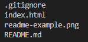

# Introduction to HTML

This project uses basis HTML elements to write short introduction about myself. Check it [here](https://hung1503.github.io/fs13-basic-html/)

## Table of content

- Technologies
- Project Stucture
- Getting Started

## Technogoies

- HTML5

## Project Structure

## Getting Started

Clone the repository from Github by using command: `git clone`
